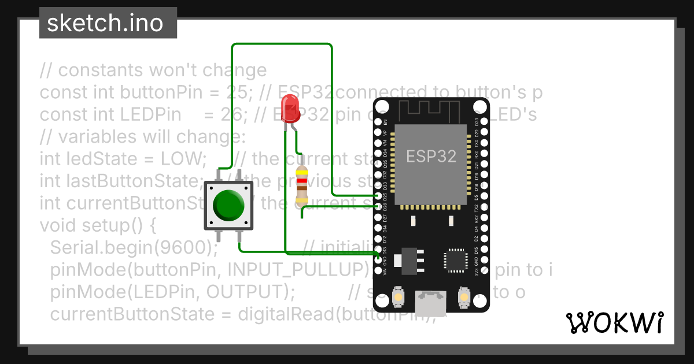

# ESP32 Button Toggle LED 🔴💡

## 🎥 Project Demo


## 🎥 Project Demo


## 📌 Description
This project demonstrates how to toggle an LED using a push button with an ESP32 DevKit V1.
Each button press changes the LED state (ON → OFF → ON).

## 🧰 Hardware Required
- ESP32 DevKit V1
- Push Button
- 5mm LED
- 220Ω Resistor
- Breadboard & Jumper Wires

## 🔌 Wiring
| Component | ESP32 Pin |
|--------|-----------|
| LED (+) | GPIO 2 |
| LED (-) | GND |
| Button | GPIO 4 → GND |

Internal pull-up resistor is used.

## 🛠️ Software
- PlatformIO
- Arduino Framework

## ⚙️ PlatformIO Configuration
```ini
[env:esp32dev]
platform = espressif32
board = esp32dev
framework = arduino